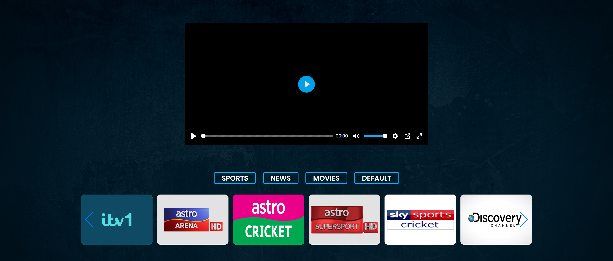

# This is a website where you can put m3u8 files and play as tv

__Just pull the code and open index.html on browser. And that's it.__
_Oh never mind add your own m3u8 files before click play button_
